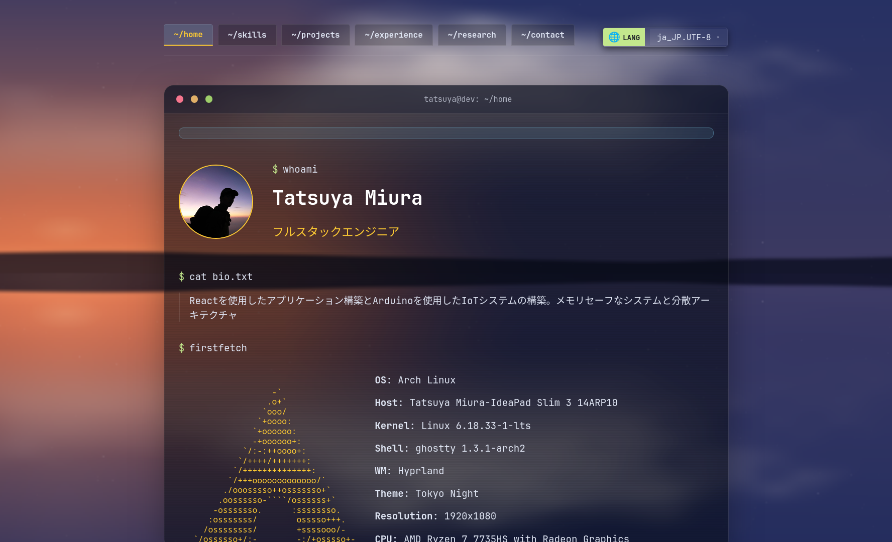

# TatsuyaM Portfolio (Hono && Bun edition)



A modern, interactive portfolio website built with **React 19**, **TypeScript**, and **Three.js**, featuring stunning 3D animations and multi-language support.

## ✨ Features

- **🎨 Modern Design**: Clean and professional portfolio interface with responsive layout
- **🌐 Multi-language Support**: English and Japanese with automatic language detection
- **🎭 3D Graphics**: Interactive 3D elements powered by Three.js
- **✨ Smooth Animations**: Beautiful transitions using Anime.js
- **📱 Responsive Design**: Optimized for desktop, tablet, and mobile devices
- **⚡ React 19 Compiler**: Built with latest React features for optimized performance
- **🚀 Vite**: Lightning-fast development and production builds
- **🔍 Type-Safe**: Full TypeScript support for robust code

## 🛠️ Tech Stack

- **Frontend**: React 19 with TypeScript (86.8%)
- **Styling**: CSS (11.9%)
- **Build Tool**: Bun
- **Backend Framework**: Hono
- **3D Graphics**: Three.js
- **Animations**: Anime.js
- **Internationalization**: i18next + react-i18next
- **Linting**: ESLint

## 📦 Dependencies

### Core Dependencies

```json
{
  "react": "^19.2.6",
  "react-dom": "^19.2.6",
  "hono": "^4.12.27",
  "three": "^0.184.0",
  "animejs": "^4.4.1",
  "i18next": "^26.3.1",
  "react-i18next": "^17.0.8"
}
```

### Dev Tools

```json
{
  "bun": "^1.3.14",
  "typescript": "~6.0.2",
  "eslint": "^10.3.0"
}
```

## 🚀 Quick Start

### Prerequisites

- Bun (v1.3.14-canary.1 or higher)

### Installation

```bash
# Clone the repository
git clone https://github.com/TatsuyaM2667/TatsuyaM-portfolio.git
cd TatsuyaM-portfolio-waamOdin

# Install dependencies
bun install
```

### Development

```bash
# Start dev server
bun run dev
```

### Production

```bash
# Build for production
bun run build

```

## 📊 Project Overview

| Metric            | Value                     |
| ----------------- | ------------------------- |
| **Language**      | TypeScript (73.6%)        |
| **Styling**       | Odin (14.5%), CSS (11.9%) |
| **Other**         | Wasm, JS, Other (0.9%)    |
| **Build Tool**    | bun                       |
| **React Version** | 19.2.6                    |
| **Hono**          | 4.12.27                   |
| **Bun**           | 1.3.14                    |

## 📁 Project Structure

```
TatsuyaM-portfolio/
├── README.md
├── apps
│   └── api
│       ├── README.md
│       ├── package.json
│       ├── public
│       │   └── static
│       │       └── style.css
│       ├── src
│       │   ├── index.tsx
│       │   └── renderer.tsx
│       ├── tsconfig.json
│       ├── vite.config.ts
│       └── wrangler.jsonc
├── build.ts
├── bun.lock
├── core
│   └── main.odin
├── eslint.config.js
├── functions
│   └── api
│       └── [[path]].ts
├── index.ts
├── package.json
├── postcss.config.js
├── public
│   ├── ScreenShot.png
│   ├── _headers
│   ├── _redirects
│   ├── dist
│   │   ├── main.css
│   │   └── main.js
│   ├── favicon.png
│   ├── icon.png
│   ├── index.html
│   └── main.wasm
├── server
│   └── index.ts
├── src
│   ├── App.css
│   ├── App.tsx
│   ├── assets
│   ├── components
│   │   ├── Background.tsx
│   │   ├── NowPlaying.tsx
│   │   ├── TerminalWindow.tsx
│   │   └── Typewriter.tsx
│   ├── hooks
│   │   └── useLanguage.tsx
│   ├── i18n.ts
│   ├── index.css
│   ├── locales
│   │   ├── de.json
│   │   ├── en.json
│   │   ├── fr.json
│   │   ├── it.json
│   │   ├── ja.json
│   │   ├── ko.json
│   │   └── zh.json
│   ├── main.tsx
│   ├── pages
│   │   ├── Contact.tsx
│   │   ├── Experience.tsx
│   │   ├── Home.tsx
│   │   ├── Projects.tsx
│   │   ├── Research.tsx
│   │   └── Skills.tsx
│   └── types
│       └── portfolio.ts
└── tsconfig.json
```

## 🌍 Language Support

The portfolio automatically detects your browser language:

- 🇬🇧 **English** - Default fallback language
- 🇯🇵 **日本語** - Japanese support
- 🇫🇷 **Français** - French support
- 🇩🇪 **Deutsch** - Germany support
- 🇨🇳 **简体中文** - Chinese support
- 🇰🇷 **한국어** - Korian support
- 🇮🇹 **Italiano** - Itarian support

Language detection powered by `i18next-browser-languagedetector`.

## 🎯 Key Features Explained

### React 19 Compiler

Leverages React 19's new compiler features for:

- Automatic component optimization
- Reduced re-renders
- Better performance

### 3D Visualizations

Three.js integration provides:

- Interactive 3D elements
- Smooth camera animations
- Custom shaders

### Anime.js Animations

Creates fluid, professional animations for:

- Page transitions
- Element reveals
- Interactive feedback

## 📝 Available Commands

```bash
bun run dev      # Start development server
bun run build    # Build for production
bun run preview  # Preview production build locally
bun run lint     # Check code quality with ESLint
```

## 🎨 Customization Guide

### Update Portfolio Content

Edit content files in `src/locales/` for multi-language updates.

### Styling

Modify CSS files in `src/styles/` to customize colors, fonts, and layout.

### Add Projects

Add portfolio projects in the projects component located in `src/components/`.

### Adjust Animations

Fine-tune Anime.js animations in animation configuration files.

### Modify 3D Elements

Update Three.js scene setup in the appropriate component files.

## 🔗 Links

- **GitHub Repository**: [TatsuyaM-portfolio](https://github.com/TatsuyaM2667/TatsuyaM-portfolio)
- **Author**: [@TatsuyaM2667](https://github.com/TatsuyaM2667)

## 📄 License

This project is open source. See the LICENSE file for details.

## 🤝 Contributing

We welcome contributions! To contribute:

1. **Fork** the repository
2. **Create** a feature branch (`git checkout -b feature/YourFeature`)
3. **Commit** changes (`git commit -m 'Add YourFeature'`)
4. **Push** to the branch (`git push origin feature/YourFeature`)
5. **Open** a Pull Request

## 📈 Performance

This portfolio is optimized for:

- Fast load times with Vite
- Smooth 60fps animations
- Efficient 3D rendering with Three.js
- Small bundle size through tree-shaking

**Last Updated**: July 2026  
**Built with ❤️ by Tatsuya M**
